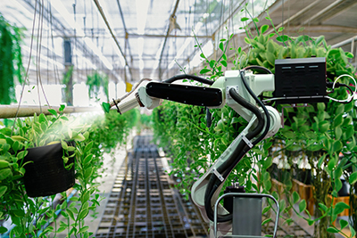

# Deep Learning and Machine Vision in Agriculture
## ABSTRACT
The agriculture industry is of central importance to U.S. economic stability due of its interconnected markets that function at global, regional, national, and local levels [1]. The U.S. agriculture industry represents 11% of all U.S. employment, contributes over 1.2 trillion dollars annually representing 5.7% of U.S. GDP production, and supplies nearly 25% of all grains to the global market [4], making it critical to the worlds food supply. But as the world’s population continues to grow to a project 10 billion by the end of the century [2], we will see increased pressure on economic stability at a very fundamental level due to global resource scarcity [3], requiring humanity to produce more with less. Additionally, dense urban populations coupled with efficient modes of transportation make cities venerable to pandemics as we have seen from the coronavirus and its rapid spread around the world, leading to subsequent shutdowns of parts of the economy and unprecedented supply and demand shock to the food system [5] through food production and labor shortages. Both scenarios present great danger to the supply chain and global security and need to be addressed to guarantee future global security.

### Objectives Completed in Project

- Machine Learning: Engineered model using Tensorflows’ Keras deep learning API to identify object classes at 97% success rate.
- Computer Vision: Implemented Pythons Computer Vision library to generate delimited pixel files to modularize proceeding tasks.
- Data Processing: Simulated various lighting conditions through data set pixel manipulation using Adobe software.
- Training Bias Reduction: Configured the randomization of delimited data using SciKit library reducing training bias & improving accuracy by over 30%.
- Testing Configuration: Developed flexible testing algorithm using Google Colab to accelerate iterations.
- Refined Model Accuracy: Successfully proved initial hypothesis and identified an 11% increase in model accuracy using Matplotlib library
